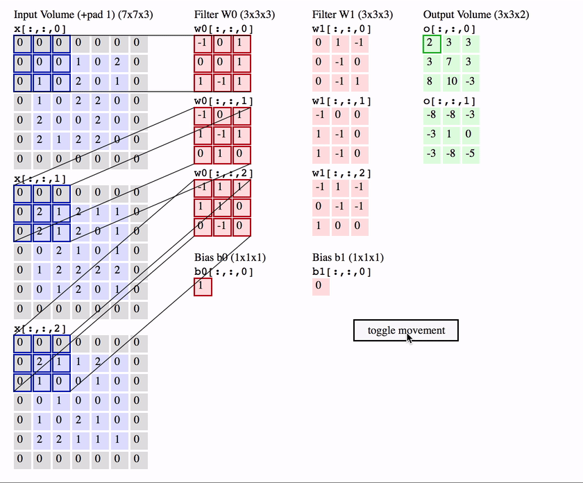

# DCGAN
# Deep Convolutional Generative Adversarial Network

## Convolutional Neural Networks

CNNs son especialmente útiles para clasificación y reconocimiento de imágenes.

CNN poseen a grandes rasgos dos componentes principales:
    1. Las capas ocultas (feature extraction)
    2. Clasificación
    

### Feature Extraction

En este componente se realizan operaciones de **convolucion** y **pooling** en las cuales los patrones son detectados.

Si se buscara reconocer una zebra por ejemplo, esta etapa reconocería las rayas, dos oídos y cuatro patas.

#### Convolución

En la convolución se dice que se convoluciona la imagen de entrada con un **kernel** o **filtro** para generar un **feature map**. Para realizar la convolución se mueve el filtro sobre la imagen de entrada multiplicando y sumando el resultado en el *feature map*. 

En la siguiente imágen peude observarse claramente cómo se realiza dicha operación.

En la práctica se realizan numerosas convoluciones sobre la entrada usando diferentes filtros. Esto genera numerosos *feature maps* los cuales se los junta para obtener la salida final de la capa de convolución.

#### Función de activación

Como en cualquier otra red neuronal, se usa una **función de activación** para que la salida sea no lineal. Por ejemplo la función ReLU (Rectified Linear Units - https://github.com/Kulbear/deep-learning-nano-foundation/wiki/ReLU-and-Softmax-Activation-Functions)

$$ f(x) = max(x, 0) $$

#### Stride

Stride se le llama al *paso* (cantidad de pixels) que el filtro debe moverse a cada iteración. Usualmente es 1. Aumentando dicho número puede reducirse el overlap.

#### Padding

El tamaño del *feature map* es SIEMPRE menor que el input. Es por eso que se debe usar **padding**.

Una capa de pixels nulos (valor cero) se agrega al input, rodeando al mismo de ceros y aumentando de esa forma su tamaño. De esta forma se logra que no se reduzca el *feature map*. El ejemplo de stride superior incluye un padding representado por los cuadrados de linea punteada.

El padding además, mejora la performance y se asegura que el tamaño del kernel y del stride sean coherentes con la entrada.

#### Pooling

Luego de una capa de convolución, es común agregar una capa de **pooling**. Su función es reducir continuamente las dimensiones reduciendo la complejidad de la red.

Lo mismo decrementa el tiempo de entrenamiento y reduce el overfitting.

##### Max Pooling

El modo más común de pooling se llama **max pooling** el cual toma el máximo valor de cada ventana. En la siguiente figura se muestra un ejemplo de max pooling:

#### Resumen

Al usar una CNN hay 4 hiperparámetros importantes entre los cuales decidir:

1. Kernel size
2. Filter count (cuantos filtros usar)
3. Stride
4. Padding

Visualización de una capa convolucional:

### Classification

Ocurre luego de las capas de convolución y pooling.

Clasifica como una red convencional sobre los patrones obtenidos.

La parte de clasificación simplemente consiste en una red fully connected convirtiendo la matriz 3D (o 2D si es grayscale) en un vector 1D.

La red se entrena igual que cualquier otra red, usando backpropagation / gradient descent.

## Generative Adversarial Network

Las gan se basan en un punto de vista de teoría de juegos. Al contrario de una red neuronal convencional. En las gan se utilizan dos redes neuronales que reciben el nombre de **Generador** y **Discriminador**. Dichas redes están en constante competencia entre ellas.

#### [1] Generative Adversarial Networks
##### Ian J. Goodfellow, Jean Pouget-Abadie, Mehdi Mirza, Bing Xu, David Warde-Farley, Sherjil Ozair, Aaron Courville, Yoshua Bengio

We propose a new framework for estimating generative models via an adversarial process, in which we simultaneously train two models: a generative model G that captures the data distribution, and a discriminative model D that estimates the probability that a sample came from the training data rather than G. The training procedure for G is to maximize the probability of D making a mistake. This framework corresponds to a minimax two-player game. In the space of arbitrary functions G and D, a unique solution exists, with G recovering the training data distribution and D equal to 1/2 everywhere. In the case where G and D are defined by multilayer perceptrons, the entire system can be trained with backpropagation. There is no need for any Markov chains or unrolled approximate inference networks during either training or generation of samples. Experiments demonstrate the potential of the framework through qualitative and quantitative evaluation of the generated samples.

En esta distribución, la red generadora intenta generar imágenes que logren engañar al discriminador haciendole creer que las imágenes son originales. El discriminador por su parte trata de no ser engañado e intenta distinguir si las imágenes fueron originales o no.

El generador recibe como entrada un vector de numeros aleatorios (que llamaremos z) y lo transforma en datos que desea imitar.

El discriminador recibo como input tanto los datos reales (x) como los generados por el generador (G(z)) y computa la probabilidad de que esa entrada sea real.

### Objective Function

El discriminador trata de maximizar la función (gradient ascent) mientras que el discriminador trata de minimizarla (gradient descent)

En la siguiente imágen, el primer término corresponde a que los datos reales tengan un alto valor mientras que motiva a los datos generados G(z) que sean ranqueados con una probabilidad baja.

Sin embargo, al aplicar esta ecuación, el generador no funciona tan bien. Esto sucede porque cuando una imagen es generada es probable que lo clasifique como falso. El gradiende tiende a ser bastante plano y dificulta que el modelo aprenda correctamente. Por dicho motivo se cambia la función del generador por la siguiente:

Es decir, que en lugar de minimizar la probabilidad de que el discriminador tenga razón, maximiza el *likelyhood* de que el discriminador se equivoque.

### Generador

La entrada del generador es una entrada aleatoria denominada *latent sample*. El generador toma esa entrada y la convierte en la imagen generada.

Resulta evidente que sin entrenamiento, la salida de la red será ruido sin significado.

### Discriminador 

El discriminador recibe una imágen y dice si la misma fue real (1) o no (0).

#### A tener en cuenta

Si el discriminador entrena mucho más rápido que el generador, el generador nunca logra engañar al discriminador. Lo mismo aplica para el otro caso en donde el discriminador termina no pudiendo clasificar apropiadamente. Se debe tener cuidado para lograr que ambos logren entrenarse a un ritmo similar.

## DCGAN

https://medium.com/@awjuliani/generative-adversarial-networks-explained-with-a-classic-spongebob-squarepants-episode-54deab2fce39

#### [2] Unsupervised Representation Learning with Deep Convolutional Generative Adversarial Networks
##### Alec Radford, Luke Metz, Soumith Chintala

In recent years, supervised learning with **convolutional networks (CNNs)** has seen huge adoption in computer vision applications. Comparatively, unsupervised learning with CNNs has received less attention. In this work we hope to help bridge the **gap between the success of CNNs for supervised learning and unsupervised learning.** We introduce a class of CNNs called deep convolutional generative adversarial networks (DCGANs), that have certain architectural constraints, and demonstrate that they are a strong candidate for unsupervised learning. Training on various image datasets, we show convincing evidence that our deep convolutional adversarial pair learns a hierarchy of representations from object parts to scenes in both the generator and discriminator. Additionally, we use the learned features for novel tasks - demonstrating their applicability as general image representations.

## Código

### Por qué Tensorflow?

La mayor parte del código se basó en https://github.com/carpedm20/DCGAN-tensorflow

### Estructuras

    1. Código original (https://github.com/carpedm20/DCGAN-tensorflow)
    2. animeGAN
    
    3. TODO: [3] - Red muy grande -> Mucho tiempo de cómputo
    
 <td>  </td>
 
 #### TensorBoard
 
  <td>  </td>
 <td>  </td>
 
 ### model.py

Métodos principales:

#### 1. Constructores/Inicializadores

*Init:*

    1.  Guarda las variables dentro del objeto.
    2.  Batch Normalization.
    3.  Se fija si es grayscale o a color (para poner la cantidad de canales).
    4.  Verifica que el batch_size sea menor a la longitud total de los datos.
    5.  Llama a build model.

*build_model:*

    1.  Setea las dimensiones según la entrada *crop*.
        a.  Si crop entonces usa la salida como tamaño de entrada y corta las imágenes desde el centro.
    2.  Llama a los consctructores del generador y el discriminador.
    3.  Llama a los consctuctores del sampler.
    4.  Crea las funciones de costo para ambas redes.
    5.  Utiliza trainable_variables y lo divide en generador y discriminador para tener la lista de las variables a entrenar.
    6.  Inicializa un objeto de clase *Saver* para ir guardando los checkpoints.

*discriminator:*
    
    -  Crea la esctructura de la red del discriminador

*generator:*
    
    -  De forma análoga a discriminador, crea la estructura de la red
    -  Utiliza deconvolución en lugar de convolución

#### 2. Entrenamiento

*train:*

    -  Adam Optimizer (parámetros beta para el decay del momentum)
    1.  Genera el ruido de entrada
    2.  Toma la cantidad de imágenes correspondiente al batch size
    3.  Intenta abrir un checkpoint
    4.  Comienza las epochs
        4.1.  Para cada epoch divide en test set según el batch size
        4.2.  Entrena D
        4.3.  Entrena G
        4.4.  Entrena G again (para que D_loss no llegue a cero)
    5.  Si hay que hacer un sample hace sample
    6.  Si checkpoint entonces guarda el checkpoint
        
    

#### 3. Checkpoint

*model_dir:*

    -  Obtiene el nombre de un directorio a utilizar para guardar el modelo según:
        1.  Nombre del dataset
        2.  batch_size
        3.  dimensiones de las imágenes de salida
        
*save:*

    -  Guarda en el directorio dado por checkpoint y "model_dir" la sesión (sess)

*load:*

    -  Abre la sesión guardada con "save"

## Resultados

<td>  </td>

<td>  </td>
<td>  </td>
<td>  </td>
<td>  </td>

<td>  </td>

<td>  </td>

### Análisis de Resultados

Original results over the dataset

<td>  </td>

Training same amount of times

<td>  </td>
<td>  </td>
<td>  </td>

## Posibles mejoras

### How to Train a GAN? Tips and tricks to make GANs work
https://github.com/soumith/ganhacks

### Dataset

https://danbooru.donmai.us/

#### Dataset no uniforme

    - Blanco y negro
    - Errores de recorte
    - Perfiles
    
[3] Dice: " [...] their (Danbooru) datasets suffer from high inter-image variance and noise. Due to the fact that image boards allow uploading of images highly different in style, domain, and quality [...]"

No solo utilizan una base de datos más homogenea sino que luego revisan todos los datos y eliminan un 4% de los falsos negativos (lo cual no se hizo en este trabajo).

<tr>
    <td>  </td>
    <td>  </td>
    <td>  </td>
   
    <td>  </td>
    <td>  </td>
    <td>  </td>
    
    <td>  </td>
    <td>  </td>
    <td>  </td>
</tr>
    
## Bibliografía:

#### [3] Towards the Automatic Anime Characters Creation with Generative Adversarial Networks

Automatic generation of facial images has been well studied after the Generative
Adversarial Network(GAN) came out. There exists some attempts applying the
GAN model to the problem of generating facial images of anime characters, but
none of the existing work gives a promising result. In this work, we explore the
training of GAN models specialized on an anime facial image dataset. We address
the issue from both the data and the model aspect, by collecting a more clean,
well-suited dataset and leverage proper, empirical application of DRAGAN. With
quantitative analysis and case studies we demonstrate that our efforts lead to a
stable and high-quality model. Moreover, to assist people with anime character
design, we build a website1 with our pre-trained model available online, which
makes the model easily accessible to general public.

