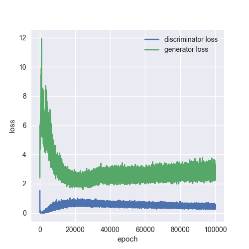
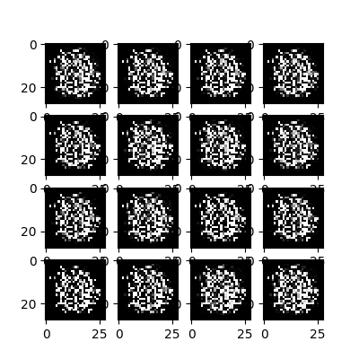

# Simple-GAN-MNIST
Simple Generative Adversarial Network to learn drawing digit from noise

This is simple approached using Generative Adversarial Network. Actually this is the application of GAN, it used to generate a sample from random noise based on certain rules, which is the true distribution.

After 3000 of epoch

Output

